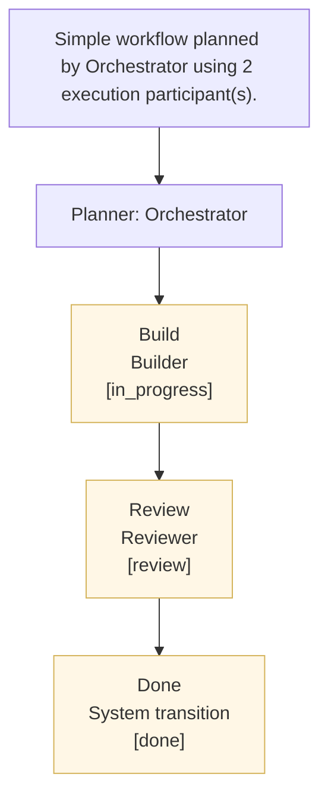

# Task Problem Statement
- Task ID: 53eeeae8-39fa-4253-93ea-d36f9873f343
- Title: Spike: Incorporate Datalaga concepts (linkings, learnings, memory, code context) into SQLite-native Styrmann
- Workspace: Datalaga
- Priority: NORMAL
- Current stage: Build (in_progress)
- Next status target: review
- Styrmann API: https://control.blockether.com/api
- Output directory: /root/repos/blockether/datalaga/.mission-control/worktrees/spike-incorporate-datalaga-conce-53eeeae8/task-artifacts/53eeeae8-39fa-4253-93ea-d36f9873f343
## Problem
Follow-up from the original Datalaga spike. Instead of using Datalaga as a dependency, extract its best ideas and implement them directly in SQLite.

Concepts to steal and build natively:

1. LINKINGS - entity-to-entity relations (task-to-task, task-to-code, criteria-to-evidence, agent-to-learning). SQLite junction tables. We already have dependencies - extend to general-purpose linkings.

2. PROJECT LEARNINGS - what worked, what failed, architectural decisions, patterns discovered during execution. Surface during dispatch so agents benefit from past context. Per-workspace learnings table.

3. MEMORY - per-agent operational knowledge (not identity - that stays in SOUL.md). Link to tasks, workspaces, agents. Query relevant memories during dispatch prompt construction.

4. CODE CONTEXT - file paths, commit SHAs, change summaries linked to tasks. Smarter dispatch context and impact analysis.

5. ACCEPTANCE CRITERIA EVALUATION - richer SQLite queries checking linked evidence, test results, deliverable artifacts. Same Datalaga-style logic, no external dependency.

Goal: take what makes Datalaga smart and build it as native SQLite tables + TypeScript in Styrmann.
## Acceptance Criteria
1. Design entity linking schema (task-to-task, task-to-code, criteria-to-evidence, agent-to-learning) as SQLite tables
2. Design project_learnings table - capture what worked, what failed, architectural decisions per workspace
3. Design agent memories table - per-agent operational knowledge linked to tasks and workspaces
4. Design code_context table - file paths, commit SHAs, change summaries linked to tasks
5. Evaluate how acceptance-gates.ts evaluation can use linked evidence and artifacts via SQLite queries
6. Recipe deliverable with schema designs, migration plan, and integration points in dispatch/workflow
7. Verifier confirms: Design entity linking schema (task-to-task, task-to-code, criteria-to-evidence, agent-to-learning) as SQLite tables
8. Verifier confirms: Design project_learnings table - capture what worked, what failed, architectural decisions per workspace
9. Verifier confirms: Design agent memories table - per-agent operational knowledge linked to tasks and workspaces
10. Verifier confirms: Design code_context table - file paths, commit SHAs, change summaries linked to tasks
11. Verifier confirms: Evaluate how acceptance-gates.ts evaluation can use linked evidence and artifacts via SQLite queries
12. Verifier confirms: Recipe deliverable with schema designs, migration plan, and integration points in dispatch/workflow
13. Evidence recorded for: Design entity linking schema (task-to-task, task-to-code, criteria-to-evidence, agent-to-learning) as SQLite tables
14. Evidence recorded for: Design project_learnings table - capture what worked, what failed, architectural decisions per workspace
15. Evidence recorded for: Design agent memories table - per-agent operational knowledge linked to tasks and workspaces
16. Evidence recorded for: Design code_context table - file paths, commit SHAs, change summaries linked to tasks
17. Evidence recorded for: Evaluate how acceptance-gates.ts evaluation can use linked evidence and artifacts via SQLite queries
18. Evidence recorded for: Recipe deliverable with schema designs, migration plan, and integration points in dispatch/workflow
19. Existing agents selected
20. No dynamic agents created
21. Findings and proposals recorded for missing capability
## Orchestrator Plan
- Simple workflow planned by Orchestrator using 2 execution participant(s).
- Expected deliverables: Execution workflow plan; Agent role and skill mapping
## Orchestrator Workflow Diagram

## Orchestrator-Selected Participants
- Builder (builder)
- Reviewer (reviewer)
## Planning Specification
---
**PLANNING SPECIFICATION:**
### Summary
Simple workflow planned by Orchestrator using 2 execution participant(s).

### Expected Deliverables
- Execution workflow plan
- Agent role and skill mapping

### Success Criteria
1. Existing agents selected
2. No dynamic agents created
3. Findings and proposals recorded for missing capability

### Constraints
- workflow name: Simple
## Role Instructions
**YOUR INSTRUCTIONS:**
Step 1: Build (in_progress)
Task: Spike: Incorporate Datalaga concepts (linkings, learnings, memory, code context) into SQLite-native Styrmann
Context: Follow-up from the original Datalaga spike. Instead of using Datalaga as a dependency, extract its best ideas and implement them directly in SQLite.

Concepts to steal and build natively:

1. LINKINGS - entity-to-entity relations (task-to-task, task-to-code, criteria-to-evidence, agent-to-learning). SQLite junction tables. We already have dependencies - extend to general-purpose linkings.

2. PROJECT LEARNINGS - what worked, what failed, architectural decisions, patterns discovered during execution. Surface during dispatch so agents benefit from past context. Per-workspace learnings table.

3. MEMORY - per-agent operational knowledge (not identity - that stays in SOUL.md). Link to tasks, workspaces, agents. Query relevant memories during dispatch prompt construction.

4. CODE CONTEXT - file paths, commit SHAs, change summaries linked to tasks. Smarter dispatch context and impact analysis.

5. ACCEPTANCE CRITERIA EVALUATION - richer SQLite queries checking linked evidence, test results, deliverable artifacts. Same Datalaga-style logic, no external dependency.

Goal: take what makes Datalaga smart and build it as native SQLite tables + TypeScript in Styrmann.
Step: Build (in_progress)
Role focus: builder
Goal: complete this step with clear evidence and handoff-ready output.
Output: concise summary of what changed, what was verified, and what the next stage needs.
Generated at: 2026-03-14T06:57:38.342Z