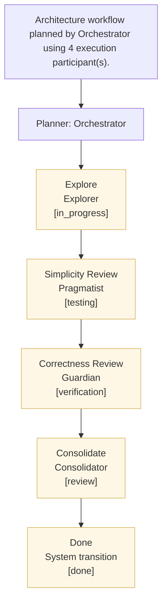

# Task Problem Statement
- Task ID: 58b21bfe-5597-45d0-ac8e-8ee43c5d94d6
- Title: Spike: Evaluate Datalaga integration with SQLite for acceptance criteria storage
- Workspace: Datalaga
- Priority: NORMAL
- Current stage: Explore (in_progress)
- Next status target: testing
- Styrmann API: https://control.blockether.com/api
- Output directory: /root/repos/blockether/datalaga/.mission-control/worktrees/spike-evaluate-datalaga-integrat-58b21bfe/task-artifacts/58b21bfe-5597-45d0-ac8e-8ee43c5d94d6
## Problem
Follow-up spike from: Spike Replace SQLite acceptance criteria storage with Datalaga.

Using the recipe deliverable from the parent spike, investigate whether Datalaga can be incorporated alongside SQLite for acceptance criteria management.

Key questions:
1. Can Datalaga Datalog queries run against SQLite-backed data without replacing the storage layer?
2. What would a hybrid architecture look like - SQLite for persistence, Datalaga for query and evaluation?
3. How would acceptance criteria gate evaluation change if using Datalaga query model?
4. What are the migration risks and breaking changes for a hybrid approach?
5. Can the current acceptance-gates.ts evaluation logic be expressed as Datalaga rules while keeping SQLite as the source of truth?
## Acceptance Criteria
1. Existing agents selected
2. No dynamic agents created
3. Findings and proposals recorded for missing capability
## Orchestrator Plan
- Architecture workflow planned by Orchestrator using 4 execution participant(s).
- Expected deliverables: Execution workflow plan; Agent role and skill mapping
## Orchestrator Workflow Diagram

## Orchestrator-Selected Participants
- Explorer (explorer)
- Pragmatist (pragmatist)
- Guardian (guardian)
- Consolidator (consolidator)
## Planning Specification
---
**PLANNING SPECIFICATION:**
### Summary
Architecture workflow planned by Orchestrator using 4 execution participant(s).

### Expected Deliverables
- Execution workflow plan
- Agent role and skill mapping

### Success Criteria
1. Existing agents selected
2. No dynamic agents created
3. Findings and proposals recorded for missing capability

### Constraints
- workflow name: Architecture
## Role Instructions
**YOUR INSTRUCTIONS:**
Step 1: Explore (in_progress)
Task: Spike: Evaluate Datalaga integration with SQLite for acceptance criteria storage
Context: Follow-up spike from: Spike Replace SQLite acceptance criteria storage with Datalaga.

Using the recipe deliverable from the parent spike, investigate whether Datalaga can be incorporated alongside SQLite for acceptance criteria management.

Key questions:
1. Can Datalaga Datalog queries run against SQLite-backed data without replacing the storage layer?
2. What would a hybrid architecture look like - SQLite for persistence, Datalaga for query and evaluation?
3. How would acceptance criteria gate evaluation change if using Datalaga query model?
4. What are the migration risks and breaking changes for a hybrid approach?
5. Can the current acceptance-gates.ts evaluation logic be expressed as Datalaga rules while keeping SQLite as the source of truth?
Step: Explore (in_progress)
Role focus: explorer
Goal: complete this step with clear evidence and handoff-ready output.
Output: concise summary of what changed, what was verified, and what the next stage needs.
Generated at: 2026-03-14T06:51:12.445Z