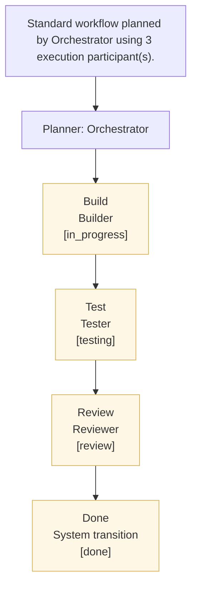

# Task Problem Statement
- Task ID: f1dbe5b3-a7e5-4a04-b546-7ea7b085c484
- Title: Follow-up: Spike: Replace SQLite acceptance criteria storage with Datalaga
- Workspace: Datalaga
- Priority: HIGH
- Current stage: Build (in_progress)
- Next status target: testing
- Styrmann API: https://control.blockether.com/api
- Output directory: /root/repos/blockether/datalaga/.mission-control/worktrees/follow-up-spike-replace-sqlite-a-f1dbe5b3/task-artifacts/f1dbe5b3-a7e5-4a04-b546-7ea7b085c484
## Problem
Follow-up spike from: "Spike: Replace SQLite acceptance criteria storage with Datalaga"
No deliverable content found from parent spike.
## Acceptance Criteria
1. Existing agents selected
2. No dynamic agents created
3. Findings and proposals recorded for missing capability
## Orchestrator Plan
- Standard workflow planned by Orchestrator using 3 execution participant(s).
- Expected deliverables: Execution workflow plan; Agent role and skill mapping
## Orchestrator Workflow Diagram

## Orchestrator-Selected Participants
- Builder (builder)
- Tester (tester)
- Reviewer (reviewer)
## Planning Specification
---
**PLANNING SPECIFICATION:**
### Summary
Standard workflow planned by Orchestrator using 3 execution participant(s).

### Expected Deliverables
- Execution workflow plan
- Agent role and skill mapping

### Success Criteria
1. Existing agents selected
2. No dynamic agents created
3. Findings and proposals recorded for missing capability

### Constraints
- workflow name: Standard
## Role Instructions
**YOUR INSTRUCTIONS:**
Step 1: Build (in_progress)
Task: Follow-up: Spike: Replace SQLite acceptance criteria storage with Datalaga
Context: Follow-up spike from: "Spike: Replace SQLite acceptance criteria storage with Datalaga"
No deliverable content found from parent spike.
Step: Build (in_progress)
Role focus: builder
Goal: complete this step with clear evidence and handoff-ready output.
Output: concise summary of what changed, what was verified, and what the next stage needs.
Generated at: 2026-03-14T06:56:38.394Z